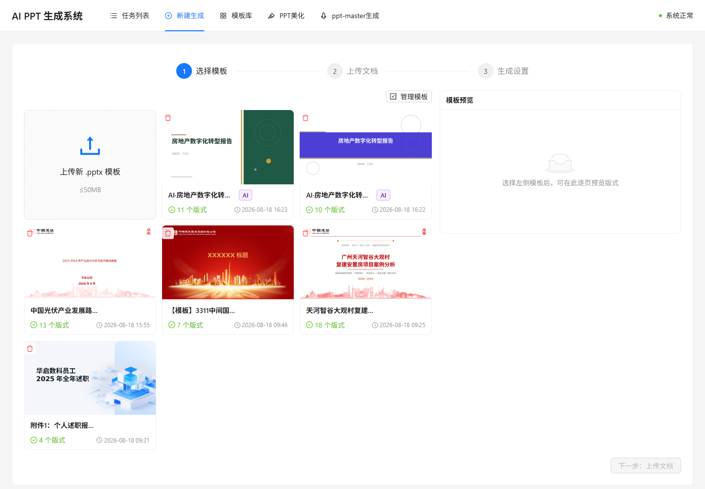
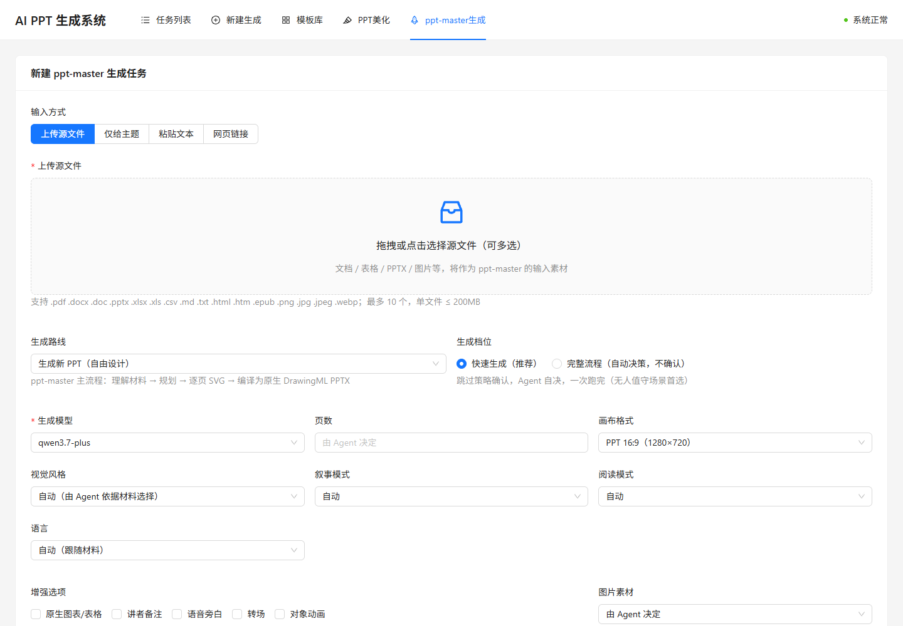
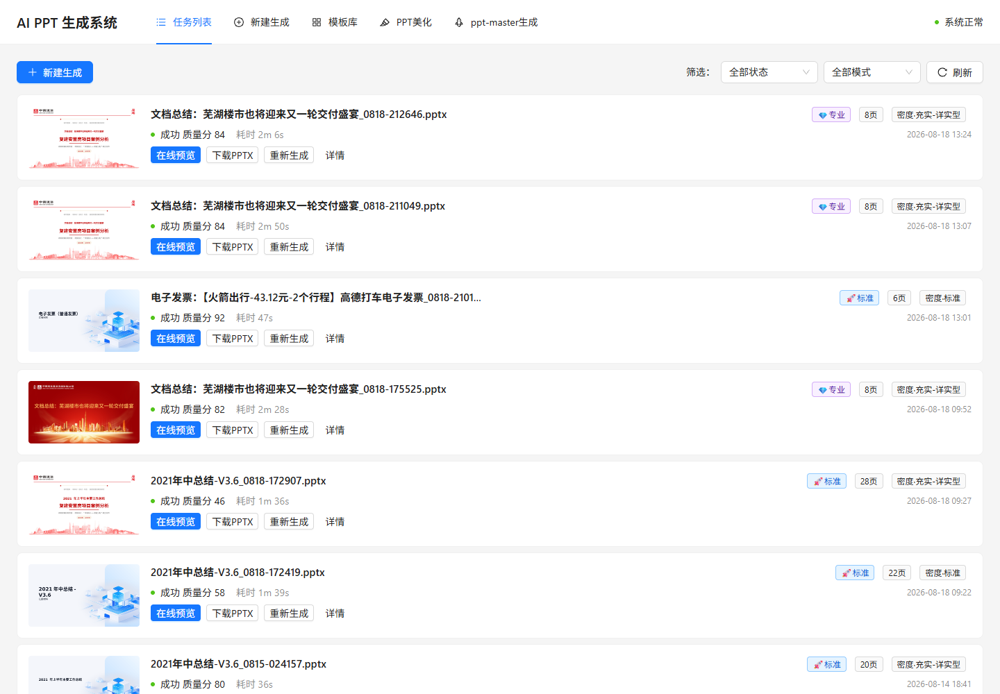
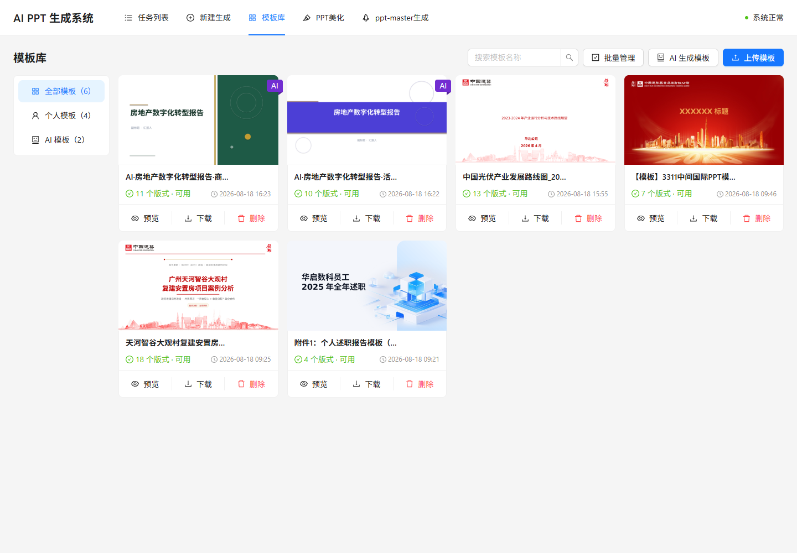
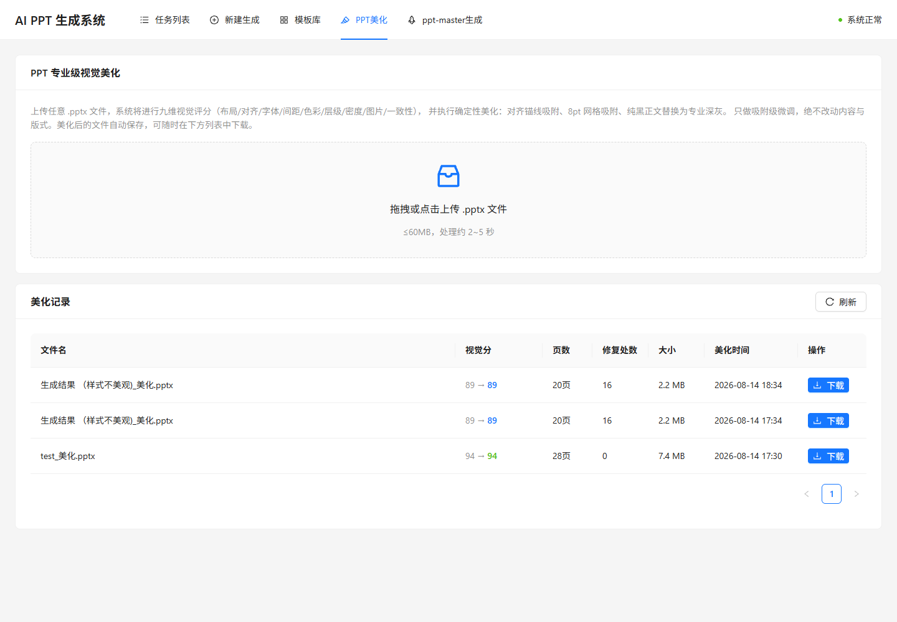

<p align="center">
  
</p>

<h1 align="center">AI PPT 自动生成系统</h1>

<p align="center">
  企业模板优先、双生成引擎、可编辑交付的开源 AI 演示文稿平台
</p>

<p align="center">
  <a href="LICENSE">MIT License</a> ·
  <a href="docs/README.md">完整文档</a> ·
  <a href="docs/06-DEVELOPMENT-DEPLOYMENT.md">开发与部署</a> ·
  <a href="http://localhost:8000/docs">Swagger</a>
</p>

**项目关键词：** AI PPT、PPT 生成、PowerPoint、企业模板、PPTX、演示文稿、智能排版、视觉分镜、布局语法、Claude Code、ppt-master、FastAPI、React、Celery、私有化部署。

这个项目不是只把文字塞进固定模板。它提供两条可以按场景选择的生成链路：一条强调企业模板、事实、版式和稳定性的“新建生成”；一条强调自由设计、丰富路线和关键页表现力的“PPT-MASTER 生成”。最终以可编辑 PPTX 为主要交付，并提供预览、报告、版本、重试和美化能力。

## 功能概览

| 能力 | 当前实现 |
|---|---|
| 新建生成 | 选择/上传企业 PPTX 模板，上传 PDF/DOCX，配置 model-id、页数、极速/标准/专业模式和内容密度 |
| 企业视觉构图 | 整册艺术指导、逐页视觉分镜、14 套布局语法、重复度控制、少量关键页自由设计 |
| 布局安全 | 所有内容容器检查上/右/下/左四个边距、Logo/页脚保护区、字体、层级、密度和相邻页连续性 |
| 模板库 | 上传、解析、AI 生成、分类、搜索、封面/逐页预览、下载、删除和批量管理 |
| 三种主模式 | 极速：章节批量；标准：页级并行 + 视觉闭环；专业：事实注册/冲突处理 + 关键页 Agent + 可选 Vision QA |
| PPT-MASTER | 文件/主题/文本/URL 输入；自由生成、模板填充、美化、增强、图片还原、创建模板等路线 |
| 模型选择 | 新建生成 4 个 model-id；PPT-MASTER 3 个 model-id；选项由 `.env` 下发并写入任务记录 |
| 异步任务 | Celery 队列、阶段 checkpoint、SSE/轮询进度、取消、断点重试、重新生成和版本链 |
| PPT-MASTER 队列 | 单部署最多 3 个 Agent 并行，超额任务保持“排队中”；列表展示模型和完整阶段历史 |
| 产物恢复 | Agent 非零退出/超时但已有完整 PPTX 时仍按成功交付；正常结束且 SVG 完整时可恢复编译 PPTX；主动取消保持 canceled |
| 在线预览 | LibreOffice 把 PPTX 转为 PDF/PNG，支持逐页预览、PPTX/PDF/质检报告下载 |
| PPT 美化 | 独立上传 PPTX，九维视觉评分、锚线/8pt 网格吸附、正文颜色修复，不变差才保存 |
| 存储 | 默认 MinIO，可通过 S3 兼容配置切换 OSS；下载由 API 代理，适合内网部署 |

## 两种生成入口怎么选

| | 新建生成 | PPT-MASTER 生成 |
|---|---|---|
| 实现 | LLM → 受控 Presentation JSON → python-pptx 确定性渲染 | Claude Code/Codex → ppt-master skill → SVG → DrawingML PPTX |
| 优势 | 稳定、速度可预测、事实/页数/模板/坐标可控 | 视觉自由度更高、输入和画布丰富、关键页表现强 |
| 取舍 | 构图受模板空间和布局语法约束 | 耗时与成本更高，Agent 进度为启发式 |
| 推荐 | 企业周报、经营分析、标准化批量生产、严格公司模板 | 提案、发布会、自由设计、模板填充、美化、图片还原 |

“新建生成”已经吸收了 PPT-MASTER 的艺术指导、视觉分镜和自由设计思路，但把它们约束在模板 Token、空间契约和冻结内容内，因此更适合“企业模板下减少重复感”。

## 界面截图

### 新建生成

三步完成企业模板选择、材料上传和模型/页数/模式/密度配置。模板可查看封面和逐页版式。



### PPT-MASTER 生成

支持多种输入方式、生成路线、模型、画布、视觉风格、叙事和增强选项。“由上传的 PPTX 模板决定”是可选风格，用户始终可以修改。



### 任务列表

集中查看状态、模式、页数、质量分、耗时和缩略图，并直接预览、下载、重新生成或进入详情。



### 模板库

统一管理个人模板和 AI 模板，支持搜索、分类、预览、下载与批量操作。



### PPT 专业级视觉美化

上传现有 PPTX 后执行九维评分和确定性微调；只有复评不下降才交付美化版。



> 截图来自本地实际运行系统，不是设计稿。任务和模板数据会随部署实例变化。

## 模型与 Key

### 新建生成

前端展示 `LLM_SELECTABLE_MODELS` 中的实际 model-id：

```dotenv
LLM_SELECTABLE_MODELS=deepseek-v4-pro,kimi-k3,qwen3.7-plus,qwen3.8-max
LLM_DEFAULT_SELECTABLE_MODEL=qwen3.7-plus
LLM_BEAUTIFY_MODEL=kimi-k3
```

| model-id | Key 来源 | 默认 Base URL 变量 |
|---|---|---|
| `deepseek-v4-pro` | `DEEPSEEK_API_KEY` | `DEEPSEEK_BASE_URL` |
| `kimi-k3` | `KIMI_API_KEY` | `KIMI_BASE_URL` |
| `qwen3.7-plus` / `qwen3.8-max` | `QWEN_API_KEY` | `QWEN_BASE_URL` |

主链路 Gateway 按 model-id 前缀选择 Provider，并负责并发、超时、重试和备用路由。成功任务的“一键美化”子任务默认使用 `kimi-k3`。独立 `/beautify` 上传美化页是规则引擎，不调用模型。

### PPT-MASTER

PPT-MASTER 使用独立模型目录：

```dotenv
PPTMASTER_SELECTABLE_MODELS=deepseek-v4-pro,qwen3.7-plus,qwen3.8-max
PPTMASTER_DEFAULT_MODEL=qwen3.7-plus
PPTMASTER_MAX_CONCURRENT_JOBS=3
```

选择的 model-id 会传给 Claude Code/Codex CLI，并存入任务表。它不会直接使用主链路的 `QWEN_API_KEY` 或 `DEEPSEEK_API_KEY`。Claude Code 路线从 `ANTHROPIC_API_KEY`，或 `ANTHROPIC_AUTH_TOKEN` + `ANTHROPIC_BASE_URL` 取凭据；Codex 路线使用 `OPENAI_API_KEY`。

## 快速开始

需要 Docker Desktop / Docker Engine 与 Compose v2。

```powershell
git clone https://github.com/topbat/ai-ppt-generator.git
Set-Location .\ai-ppt-generator\deploy
Copy-Item .env.example .env
# 编辑 .env：至少配置一个主链路模型 Key
docker compose up -d --build
```

访问：

- Web：<http://localhost:8081>
- Swagger：<http://localhost:8000/docs>
- MinIO Console：<http://localhost:9001>

如果暂时没有模型 Key，可在 `.env` 设置 `LLM_MOCK=true` 验证上传、队列、渲染、存储和预览链路。

### 启用 PPT-MASTER

在 `deploy/.env` 配置 Agent 凭据后执行：

```powershell
docker compose --profile pptmaster up -d --build
docker compose --profile pptmaster ps -a
```

阿里云百炼 Claude Code 兼容端点示例：

```dotenv
PPTMASTER_DEFAULT_AGENT=auto
ANTHROPIC_AUTH_TOKEN=<在本地填写，不要提交>
ANTHROPIC_BASE_URL=https://<WorkspaceId>.cn-beijing.maas.aliyuncs.com/apps/anthropic
```

`ANTHROPIC_BASE_URL` 必须是绝对 URL；百炼 Workspace 地址以 `/apps/anthropic` 结尾，不要追加 `/v1`。

## 架构

```text
                          ┌─────────────────────┐
                          │ React + Nginx       │ :8081
                          └──────────┬──────────┘
                                     │ REST / SSE
                          ┌──────────▼──────────┐
                          │ FastAPI             │ :8000
                          └───┬────────┬────────┘
                              │        │
                    ┌─────────▼─┐  ┌──▼──────────┐
                    │ Redis      │  │ PostgreSQL  │
                    └─────┬──────┘  └─────────────┘
                          │ Celery
            ┌─────────────┴────────────────┐
            ▼                              ▼
┌─────────────────────────┐   ┌────────────────────────────┐
│ 主 Worker               │   │ PPT-MASTER Worker（可选） │
│ JSON → python-pptx      │   │ Agent → SVG → DrawingML   │
│ generate / convert      │   │ pptmaster，最多并发 3     │
└────────────┬────────────┘   └─────────────┬──────────────┘
             └──────────────┬───────────────┘
                            ▼
                    ┌──────────────┐
                    │ MinIO / OSS  │
                    └──────────────┘
```

默认 Compose 包含 `frontend`、`api`、`worker`、`postgres`、`redis`、`minio`、`minio-init`；启用 `pptmaster` profile 后增加独立 `pptmaster-worker`。`minio-init` 创建桶后显示 `Exited (0)` 是正常状态。

## 本地开发

### 后端

```powershell
Set-Location .\deploy
docker compose up -d postgres redis minio minio-init

Set-Location ..\backend
Copy-Item .env.example .env
python -m venv .venv
.\.venv\Scripts\Activate.ps1
python -m pip install -r requirements.txt
uvicorn app.main:app --reload --host 0.0.0.0 --port 8000
```

另开终端启动 Worker：

```powershell
Set-Location .\backend
.\.venv\Scripts\Activate.ps1
celery -A app.worker worker -Q generate,convert --loglevel INFO --pool=solo
```

### 前端

```powershell
Set-Location .\frontend
npm ci
npm run dev -- --host 0.0.0.0 --port 5800
```

开发服务器通过 Vite 把 `/api` 代理到 `http://localhost:8000`。详细环境变量、Linux/生产注意事项和运维命令见 [开发、配置与部署](docs/06-DEVELOPMENT-DEPLOYMENT.md)。

## 测试

```powershell
python -m pytest backend/tests -q
npm --prefix frontend test -- --run
npm --prefix frontend run build
docker compose --profile pptmaster -f deploy/docker-compose.yml config --quiet
```

## 生产部署要点

- 修改默认数据库、MinIO 和所有 API 凭据；真实 `.env` 不得提交；
- `S3_PUBLIC_ENDPOINT` 必须改为浏览器可达的 HTTPS 域名；
- PostgreSQL、Redis、MinIO API 不应直接暴露公网；
- 在反向代理层增加 TLS、登录鉴权、请求体限制和访问日志；当前应用本身没有认证/多租户；
- PPT-MASTER 使用无人值守 Agent 权限，只在独立非 root 容器运行；
- 持久化并备份 `pgdata`、`miniodata`、`redisdata` 与 `pptmaster-projects`；
- 可以扩容普通 Worker；不要用多个 PPT-MASTER Worker 绕过单部署三并发上限。

更新部署：

```powershell
Set-Location .\deploy
docker compose --profile pptmaster build --pull
docker compose --profile pptmaster up -d --force-recreate
docker compose --profile pptmaster ps -a
```

## 目录

```text
.
├── backend/                 FastAPI、Celery、主流水线、PPT 渲染与 PPT-MASTER 包装
├── frontend/                React 18 + TypeScript + Ant Design
├── deploy/                  Docker Compose、环境变量示例、数据库初始化
├── docs/                    产品、UI、实现、视觉、PPT-MASTER、开发部署文档
│   ├── images/              Logo 与实际功能截图
│   └── plans/               历史设计/实施计划
└── ppt-master/              本地集成仓库（默认被当前仓库忽略，容器构建时获取）
```

## API 与详细文档

- [文档中心](docs/README.md)
- [产品需求](docs/01-PRD.md)
- [UI 与交互](docs/02-UI-DESIGN.md)
- [整体实现](docs/03-IMPLEMENTATION.md)
- [视觉优化](docs/04-VISUAL-OPTIMIZATION.md)
- [PPT-MASTER 集成](docs/05-PPTMASTER-INTEGRATION.md)
- [开发、配置与部署](docs/06-DEVELOPMENT-DEPLOYMENT.md)

运行后可在 Swagger 查看当前 API 的请求和响应 Schema：<http://localhost:8000/docs>。

## 当前边界

- 扫描 PDF OCR 默认未实现，无有效文本时返回 E2003；
- 完整 embedding/RAG、Prometheus/Grafana、自动产物清理和按用户并发配额尚未落地；
- 当前没有登录鉴权和多租户隔离，不应直接裸露到公网；
- PPT-MASTER 的 URL 在 API 层只验证格式，应用层固定最多三次抓取的护栏尚未独立实现；
- PPT-MASTER 单任务不能续接原 Agent 会话，但已有完整导出或 SVG 时可做产物级恢复；
- 高级动画、旁白、图片搜索/生成依赖 ppt-master 及对应外部 Provider 配置。

## 开源协议

本仓库代码采用宽松的 [MIT License](LICENSE)：允许使用、复制、修改、合并、发布、分发、再许可和销售，但需要保留版权及许可声明，软件按“现状”提供且不附带担保。

第三方依赖、字体、容器镜像以及构建时获取的 [ppt-master](https://github.com/hugohe3/ppt-master) 仍分别遵循各自许可证；本仓库的 MIT 许可不会覆盖或替代第三方许可。

Logo 使用图像生成工具为本项目生成，源文件位于 [`docs/images/logo.png`](docs/images/logo.png)。
