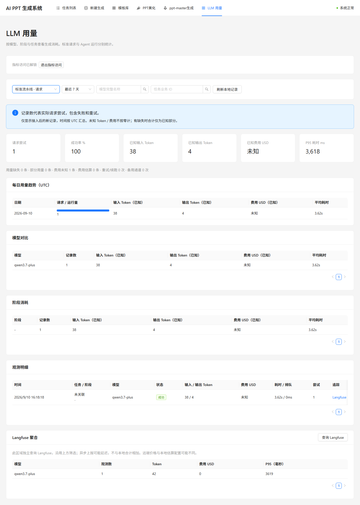
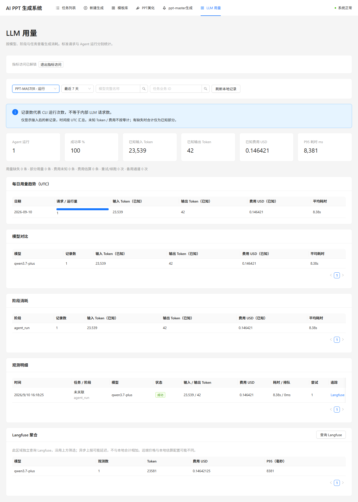
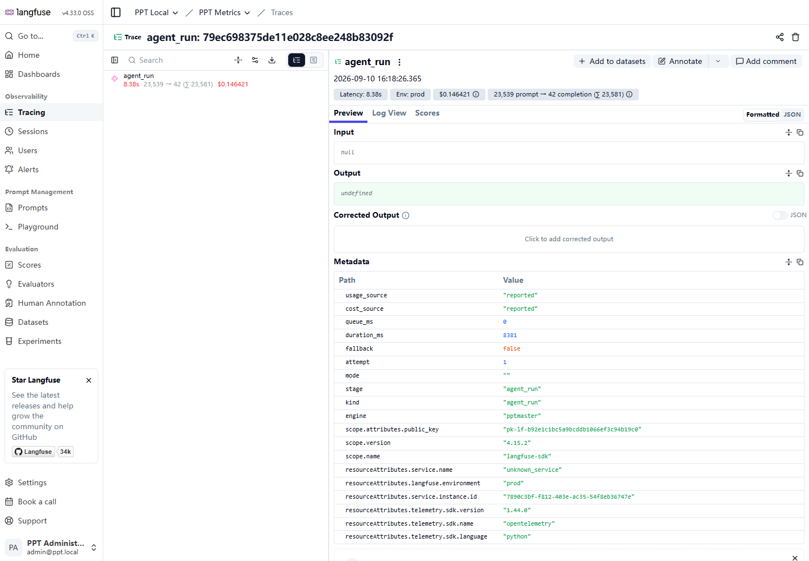
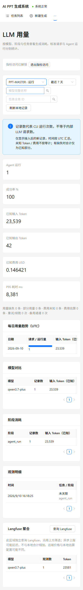

# Langfuse 容器部署与真实指标验收报告

验收日期：2026-09-10（北京时间）。项目：main-ppt；Compose 项目：ppt-generator。

## 验收结论

已部署 Langfuse Web、Langfuse Worker、ClickHouse，并重建业务 API、两类 Worker 与前端。真实模型调用经业务采集、SQL 持久化、Langfuse 上报、ClickHouse 存储、Metrics v2 查询到中文页面展示的链路验收通过。

## 部署结构

- 新增 langfuse-web / langfuse-worker（Langfuse 4.33.0 OSS）和 clickhouse（25.12.11.4），均属于 ppt-generator 默认网络。
- 复用现有 PostgreSQL 16 容器，为 Langfuse 创建专用 langfuse 数据库和 ppt_langfuse 账号。原有业务数据库连接保持不变，仍按既有环境连接 host.docker.internal:5432/ppt。
- 复用现有 Redis，使用 DB 4；复用 MinIO，使用独立 langfuse 桶及 events/、media/ 前缀。初始化服务幂等创建资源，已有密钥保持不变。
- Langfuse Web 仅映射本机 127.0.0.1:3000；Worker 和 ClickHouse 无宿主机映射端口。没有另建长期运行的容器组。
- 12 个项目容器中 10 个运行、2 个初始化容器退出码为 0。Langfuse Web、Worker、ClickHouse 健康；业务 API、数据库、Redis、MinIO 健康，前端 HTTP 200，两类 Celery Worker 均响应 pong。

数据流：业务 Gateway / ClaudeRunner → 本地 llm_observations + Langfuse SDK → Web 接收 → 共享 MinIO / Redis → Langfuse Worker → ClickHouse → Metrics API → 中文 LLM 用量页。

## 后端与页面能力

标准流水线按实际请求尝试采集，记录成功、失败、重试和备用通道；PPT-MASTER 按 CLI 运行采集，可汇总续跑用量，不能视为内部 LLM 请求次数。已实现输入/输出及缓存 Token、耗时、已知/未知/估算费用、模型/阶段/任务关联、本地统计和远端聚合。指标 API 使用 Bearer 令牌保护，默认不上报输入输出正文，观测异常不阻断业务调用。

## 测试结果

| 检查 | 结果 |
|---|---|
| 后端 pytest 全量 | 120 passed，1 条依赖弃用警告 |
| 前端 Vitest | 11 passed |
| 前端 TypeScript / Vite 生产构建 | 通过；存在现有大 bundle 提示 |
| 部署配置与初始化幂等性 | 2 passed（最终配置再次验证） |
| API healthz / readyz | 200；数据库、Redis、存储、转换检查通过 |
| 缺失令牌 / 错误令牌 / 非法日期范围 | 401 / 401 / 422，符合预期 |
| 真实 Gateway 与 Claude CLI 调用 | 两条路径均成功，模型 qwen3.7-plus |
| 本地记录与 Langfuse Observations v2 | 输入（含缓存）及输出 Token 对账一致 |
| Langfuse Metrics v2 聚合与模型筛选 | 记录数一致；有效模型命中，不存在模型返回空 |
| 默认内容保护 | 远端输入输出正文为空 |
| ClickHouse SQL | SELECT 执行成功；2 条独立观测（3 条物理版本记录） |
| 浏览器与窄屏 | 实际指标和 Trace 页面可用；390px 视口文档宽度 390px |

### 真实调用记录

| 路径 | 输入 Token | 输出 Token | 耗时 | 费用口径 |
|---|---:|---:|---:|---|
| 标准 Gateway 请求 | 38 | 4 | 3,618 ms | 未知，不按免费处理 |
| Claude CLI 运行 | 23,539 | 42 | 8,381 ms | CLI 报告 0.14642125 USD |

Claude 输入包含 22,141 个 cache creation Token，cache read 为 0。CLI 报告费用不是模型供应商账单核验。标准请求在 Langfuse 聚合中显示费用 0，但本地正确保留为未知；远端价格配置和本地费用来源可能不同。截图中远端标准请求耗时为 3,619ms，与本地 3,618ms 的精度/取整差异不影响 Token 对账。

探针直接调用实际运行器，没有创建虚构 PPT 任务，因此截图显示“未关联”。本次未进行完整 PPT 产物质量测试、多模型全覆盖或并发压测。采集为尽力上报，尚不承诺进程硬退出或长期离线情况下的持久化补发与恰好一次投递。既有 ENV=prod 是配置标签，本报告只证明本机容器部署。

## 实际截图

### 标准请求：本地明细与 Langfuse 聚合



### Claude CLI：Token 与报告费用



### Langfuse：真实观测详情



### 窄屏：390px 指标页



## 访问与复现

- 指标页：http://localhost:8081/metrics
- Langfuse：http://localhost:3000，管理员账号 admin@ppt.local。
- 管理员密码及指标令牌分别为 deploy/langfuse/.env 中的 ADMIN_PASSWORD、METRICS_ACCESS_TOKEN；该文件忽略提交，报告不包含秘密值。
- 部署命令及增量构建方式见 ../../docs/07-LANGFUSE.md；实现方案见 ../../docs/plans/2026-09-10-langfuse-live.md。

```powershell
# 已构建镜像的启动/更新命令；在项目根目录执行
docker compose --env-file deploy/langfuse/.env -f deploy/docker-compose.yml -f deploy/docker-compose.langfuse.yml --profile pptmaster up -d --no-build

# 回归测试
.worktrees/langfuse-observability/.venv312/Scripts/python.exe -m pytest backend/tests -q
npm --prefix frontend test -- --run

# 只读取已有真实记录进行对账，不触发新模型调用
.worktrees/langfuse-observability/.venv312/Scripts/python.exe -X utf8 backend/tests/verify_live_metrics.py --output deliverables/langfuse-live-2026-09-10/live-results.json
```

原始证据：live-results.json（接口与双路径对账）、containers.json（实际镜像与容器状态）、clickhouse.json（SQL 结果）。本轮未提交或推送 Git。

## 官方参考

- [Docker Compose 部署](https://langfuse.com/self-hosting/deployment/docker-compose)
- [无人值守初始化](https://langfuse.com/self-hosting/administration/headless-initialization)
